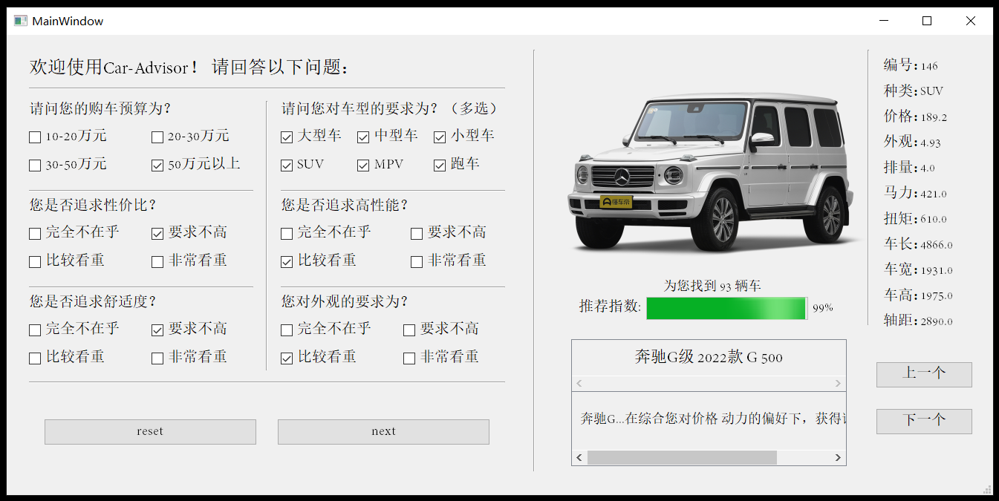
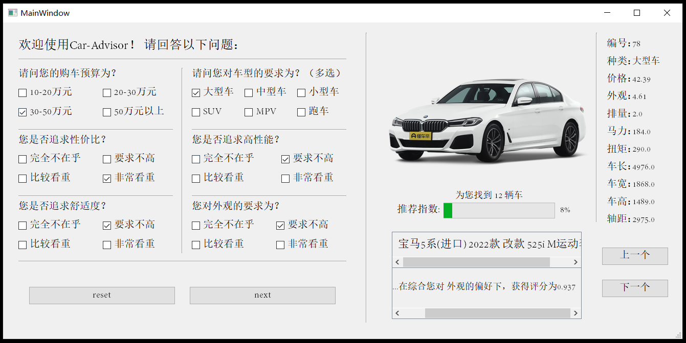

# CarAdvisor
2022 AI course project. Fudan University

How to run: Download the zip, run main.exe in the CarAdvisor-app folder.

Project has been tested on Win10 system with python 3.7 environment.

## 系统架构（System Architecture）

系统内部的核心是存储了各种汽车相关参数和信息的数据库，并利用领域专家提供的规则进行模糊规则映射，给出不同汽车在不同方面如性能、舒适度等的性能评分，得到带有不同评分的汽车数据。系统引导用户回答预设的一系列问题，并由用户提交的信息获得用户的偏好情况，推理引擎工作，结合数据库和规则库中的信息与用户的偏好，给出智能的推荐。

## 推荐算法（Recommendation Algorithms）

指定问题并定义语言变量 → 定义模糊集 → 抽取并构造模糊规则 → 系统评估

details in `CarAdvisor汽车选购推荐系统设计.pdf`

## 运行展示（Running demonstration）

左侧为用户输入界面，用户需要根据问题和提示，通过单击选择框进行单选或多选，完成用户偏好的输入。

右侧为推荐汽车的具体参数列表，此外，还有推荐指数、推荐车型名称以及推荐理由显示区域。

